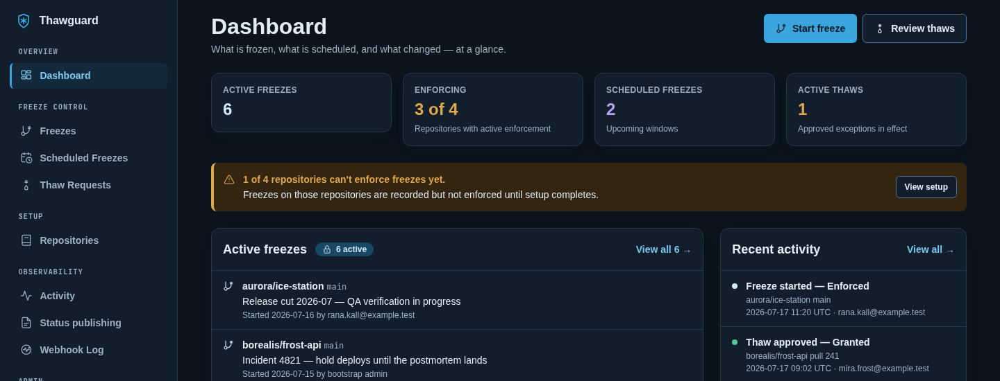

# Thawguard

Freeze branches. Thaw exceptions. Keep release flow auditable.

Thawguard is a self-hosted branch-freeze controller for Forgejo/Codeberg-first teams. It helps trusted maintainers pause merges into selected branches during QA, releases, deployments, or incidents, while allowing explicit audited per-PR exceptions when a fix must land.

## Status

Pre-alpha developer preview. The core Forgejo/Codeberg freeze, scheduled-freeze, thaw-exception, readiness, audit, and recovery workflows are implemented and exercised against a disposable local Forgejo instance. Thawguard is not ready for production use yet.



Project links:

- [Roadmap](ROADMAP.md)
- [Roadmap discussion](https://github.com/taua-almeida/thawguard/issues/7)
- [Canonical issue tracker](https://github.com/taua-almeida/thawguard/issues)
- [Contributing](CONTRIBUTING.md)
- [Security policy](SECURITY.md)

## Important boundary

Thawguard is cooperative enforcement for trusted teams. It is intended to prevent accidental merges and automate auditable freeze workflows. It is not a hard security boundary against repository writers who can post forge commit statuses with sufficient token permissions.

## How enforcement works

Thawguard has one operational mode. Each repository carries a persisted enforcement state:

- New and existing repositories start **setup incomplete**. Setup (encrypted webhook secret, encrypted status token, signed webhook deliveries) and read-only readiness checks stay fully available, but no commit status is ever posted and freeze, scheduled-freeze, and thaw actions are rejected.
- An **enforcement-active** repository has one behavior: freeze lifecycle actions synchronize current open pull requests from the forge, evaluate each affected head SHA across the whole repository (including PRs on other target branches sharing the same commit), and post the real `thawguard/freeze` commit status. A missing token or forge failure fails closed: no stale status is posted, and failures during posting are recorded as sanitized failed attempts. If convergence fails after a policy change commits, the repository becomes unhealthy and one durable SQLite job retries the complete current-state recovery proof with bounded backoff; an admin can also retry that same recovery immediately.

Read-only readiness checks verify pull-request access, branch protection for every exact managed branch, required status checks, the exact `thawguard/freeze` context, and recent signed `pull_request` webhook evidence. They never post a synthetic status. Explicit activation reruns readiness, performs a controlled `thawguard/setup` status-post test, synchronizes current open pull requests, and publishes current `thawguard/freeze` policy before enforcement becomes active. There is no shadow or dry-run runtime mode.

## Managed branches

Each repository has an explicit list of managed branches: the exact branch names Thawguard may freeze or schedule. There are no globs, patterns, prefixes, or rules — `release/1.4` manages exactly the branch named `release/1.4`, and `release/*` would be a literal branch name, never a pattern.

- Every repository always manages at least its default branch; the default branch cannot be removed.
- Admins add or remove exact branch names on `/repositories`. Removal is rejected while the branch has an active or pending scheduled freeze; ended or cancelled history never blocks removal.
- Branch scope is locked while a repository is enforcement-active.
- Freeze and scheduled-freeze creation are rejected server-side for any branch that is not managed for the selected repository.
- Newly added branches are unverified until an administrator runs readiness checks and the forge confirms their setup.

## Scheduled freezes

Thawguard freezes branches on a schedule in two ways: one-time scheduled freezes and named recurring schedules. Recurring schedules freeze an exact managed branch repeatedly on weekly rules or manually entered dated windows, with an explicit persisted IANA timezone, defined daylight-saving behavior, optional reasons, and truthful scheduler attribution in forge status descriptions. Coverage is additive: a branch is frozen while any manual freeze, one-time schedule, or recurring schedule covers the current moment. See [`docs/scheduled-freezes.md`](docs/scheduled-freezes.md) for the full contract.

One-time scheduled freezes are pending windows for an exact repository and managed branch. A Freezer for that repository can edit a pending schedule's reason, future start time, and optional planned unfreeze; repository and branch remain immutable. Clearing the planned-unfreeze field removes it.

**Start Now** activates a still-pending future schedule immediately when repository enforcement is active. It preserves any future planned unfreeze, synchronizes current open pull requests, evaluates shared heads across the repository, and publishes real `thawguard/freeze` statuses through the same durable convergence path as automatic due activation. A post-commit failure leaves the schedule active, marks enforcement unhealthy, and retains one bounded-backoff reconciliation job for current-state recovery.

Only pending one-time schedules can be edited, cancelled, or started now. Schedule archive controls remain deferred.

## Roadmap and issue tracking

The current direction is documented in [ROADMAP.md](ROADMAP.md). GitHub is the canonical public issue tracker so plans and discussion do not fragment between mirrors. The [Codeberg repository](https://codeberg.org/taua-almeida/thawguard) remains available as a source mirror and carries the same versioned roadmap and contributor documentation.

Roadmap items describe direction rather than release promises. Accepted work is broken into scoped issues before implementation.

## Local development

```sh
go test ./...
go run ./cmd/thawguard
```

The service listens on `127.0.0.1:8080` by default. Override with `THAWGUARD_HTTP_ADDR`. Until the first local admin user exists, Thawguard refuses non-loopback bind addresses for first-admin setup.

The service creates `thawguard.db` by default. Override with `THAWGUARD_DB_PATH`.

Runtime configuration is environment-variable based. The binary does not currently parse CLI flags such as `--db` or `--addr`; use `THAWGUARD_DB_PATH` and `THAWGUARD_HTTP_ADDR` instead.

`THAWGUARD_PUBLIC_URL` is the canonical browser origin and the origin used for generated recovery links. It must be a root-only HTTPS URL with no credentials, query, or fragment. HTTP is accepted only for the hostname `localhost` or a literal loopback IP address. Internationalized and punycode (`xn--`) hostnames are currently unsupported; configure an ordinary ASCII hostname.

For a Docker-based local alpha runbook, see [`docs/local-alpha.md`](docs/local-alpha.md).

The runbook includes a persistent loopback-only Thawguard + Forgejo stack and a disposable real-Forgejo smoke test:

```sh
make local-up    # retain Forgejo and Thawguard state across stop/start
make local-down
make e2e         # fresh isolated stack; always removes containers and volumes
```

`make e2e` opens a real local Forgejo pull request so Forgejo emits the signed webhook, then verifies `thawguard/freeze` failure/success posting and required-status merge blocking. It is explicitly gated; ordinary `go test ./...` never starts Docker.

Repository webhook secrets and status-posting tokens are encrypted before they are stored. To enable secret/token setup in local development, set `THAWGUARD_SECRET_KEY` to a stable, high-entropy, base64-encoded 32-byte installation key. Without this key, the rest of the local UI remains usable, but webhook secret and status token setup are disabled. Losing or changing this key makes stored secrets and tokens undecryptable.

The local signed webhook receiver is `POST /webhooks/forgejo`. It verifies configured repository webhook secrets and records sanitized delivery results. For a setup-incomplete repository it also refreshes the local PR cache as setup evidence; for an enforcement-active repository it additionally recomputes and posts the `thawguard/freeze` status.

Current local pages:

- `/` dashboard
- `/setup` first local admin setup when no users exist; the first account starts as Admin with no implicit Freeze or Thaw action grants
- `/login` and `/logout` local user session flow
- `/repositories` repository setup form, enforcement state, managed branch scope, and read-only readiness evidence
- `/freezes` immediate branch-freeze form and active list, with an optional planned unfreeze time (requires an enforcement-active repository)
- `/scheduled-freezes` one-time scheduled freeze windows and named recurring schedules, with weekly rules, dated windows, per-schedule timezones, and activation/pause controls
- `/decisions` immediate thaw approval; fetches the current PR head from the forge and scopes the thaw to that PR/head SHA (requires an enforcement-active repository)
- `/activity` primary chronological audit history for recent operator and system changes, with actor, action, affected target, outcome, timestamp, and curated sanitized details
- `/webhooks` secondary webhook delivery diagnostics with filters, verification state, and sanitized local processing outcomes
- `/publications` secondary status-publication diagnostics for latest desired statuses and recent posted or failed attempts
- `/users` admin-only Users & Access directory; `/users/{id}` manages account state, global Admin access, per-repository Viewer, Freezer, and Thaw-approver grants, and one-hour manual password-recovery links for other enabled users

Admin is global installation management and can view every repository. Viewer, Freezer, and Thaw approver are granted per repository; any scoped grant permits reading that repository, while Freezer and Thaw approver permit only their matching actions. Admin does not imply either action role, including scheduled-freeze editing or Start Now. New local users begin active but with zero repository access and must replace their temporary password at first sign-in. If you bind beyond loopback after first-admin setup, keep Thawguard behind the network controls appropriate for your trusted team.

Admins can issue a manual recovery link from Users & Access and share it through a trusted channel. The bearer link expires after one hour and is displayed only once. Email delivery and public forgot-password requests are not part of this flow.

Activity and diagnostic pages render allowlisted, sanitized metadata only. They never display raw webhook payloads, request signatures or headers, secrets, tokens, passwords or hashes, raw forge response bodies, or session IDs. Activity retention, deep-history pagination, export, and deletion remain deferred.

## License

Thawguard is licensed under the GNU Affero General Public License v3.0. See [LICENSE](LICENSE).
